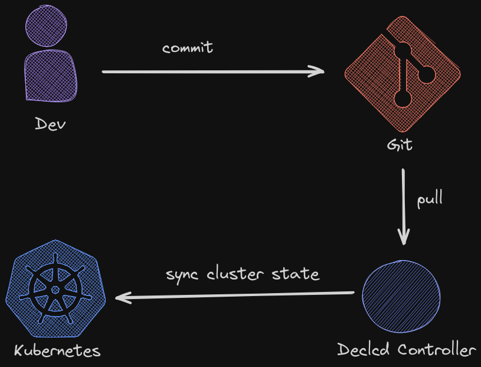

<br>
<div align="center">
	
	
  <p align="center">
		<strong>A Declarative Continuous Delivery Toolkit For Kubernetes</strong>
  </p>
  <p>
		
		
  </p>
</div>
<br>

## Table of Contents
- [Introduction](#introduction)
- [Installation](#installation)
- [Getting Started](#getting-started)
- [Contributions](#contributions)
- [License](#license)

## Introduction

Traditional GitOps tools often rely on YAML for configuration, which can lead to verbosity and complexity. Declcd leverages [CUE](https://cuelang.org/), a configuration language with a more concise and expressive syntax, making it easier to define and maintain your desired cluster state.



## Installation

> [!NOTE]
> Currently we don't maintain our binaries in any package manager.

Linux(x86_64):

```bash
curl -L -o declcd.tar.gz https://github.com/kharf/declcd/releases/download/v0.16.0-dev.22/declcd_linux_x86_64.tar.gz
tar -xf declcd.tar.gz
chmod +x declcd
./declcd -h
```

MacOS(x86_64):

```bash
curl -L -o declcd https://github.com/kharf/declcd/releases/download/v0.16.0-dev.22/declcd_darwin_x86_64.tar.gz
tar -xf declcd.tar.gz
chmod +x declcd
./declcd -h
```

MacOS(arm64):

```bash
curl -L -o declcd https://github.com/kharf/declcd/releases/download/v0.16.0-dev.22/declcd_darwin_arm64.tar.gz
tar -xf declcd.tar.gz
chmod +x declcd
./declcd -h
```

## Getting Started

> [!IMPORTANT]
> It is strongly recommended to familiarize yourself with [CUE](https://cuelang.org/) before you begin, as it is one of the cornerstones of Declcd.

### Basics of Declcd

While Declcd does not enforce any kind of repository structure, there is one constraint for the declaration of the cluster state.
Every top-level CUE value in a package, which is not hidden and not a [Definition](https://cuelang.org/docs/tour/basics/definitions/), has to be what Declcd calls a *Component*.
Declcd Components effectively describe the desired cluster state and currently exist in two forms: *Manifests* and *HelmReleases*.
A *Manifest* is a typical [Kubernetes Object](https://kubernetes.io/docs/concepts/overview/working-with-objects/), which you would normally describe in yaml format.
A *HelmRelease* is an instance of a [Helm](https://helm.sh/docs/intro/using_helm/) Chart.
All Components share the attribute to specify Dependencies to other Components. This helps Declcd to identify the correct order in which to apply all objects onto a Kubernetes cluster.
See [schema](schema/schema.cue).

> [!IMPORTANT]
> Dependency relationships are represented in the form of a Directed Acyclic Graph, thus cyclic dependencies lead to errors.

### From Start to Finish

> [!NOTE]
> For the purpose of demonstration this guide uses [Kind](https://kind.sigs.k8s.io/docs/user/quick-start/) to create a Kubernetes cluster and Github.
> We recommend that beginners follow along with both.

> [!IMPORTANT]
> Requirements:
> - Declcd
> - Git
> - Go
> - An empty git repository
> - A GitHub personal access token with repo permissions

#### Create Kind Cluster

```bash
kind create cluster --name declcd
```

#### Initialize a Declcd GitOps Repository

```bash
mkdir mygitops
cd mygitops
git init
git remote add origin git@github.com:user/mygitops.git
# init Declcd gitops repository as a CUE module
export CUE_EXPERIMENT=modules
export CUE_REGISTRY=ghcr.io/kharf
declcd init github.com/user/mygitops@v0
go mod init mygitops
declcd verify
git add .
git commit -m "Init declcd"
git push -u origin main
```
See [CUE module reference](https://cuelang.org/docs/reference/modules/#module-path) for valid CUE module paths.

#### Install Declcd onto your Kubernetes Cluster

```bash
declcd install \
  -u git@github.com:user/mygitops.git \
  -b main \
  --name dev \
  -t <token>
git add .
git commit -m "Install declcd"
```

#### Deploy a Manifest and a HelmRelease

Get Go Kubernetes Structs and import them as CUE schemas.

> [!TIP]
> Use CUE modules and provide these CUE schemas as OCI container.

```bash
go get k8s.io/api/core/v1
cue get go k8s.io/api/core/v1
cue get go k8s.io/apimachinery/pkg/api/resource
cue get go k8s.io/apimachinery/pkg/apis/meta/v1
cue get go k8s.io/apimachinery/pkg/runtime
cue get go k8s.io/apimachinery/pkg/types
cue get go k8s.io/apimachinery/pkg/watch
cue get go k8s.io/apimachinery/pkg/util/intstr
mkdir infrastructure
touch infrastructure/prometheus.cue
```

Edit `infrastructure/prometheus.cue` and add:

```CUE
package infrastructure

import (
	"github.com/kharf/declcd/schema@v0"
	corev1 "k8s.io/api/core/v1"
)

// Public Declcd Manifest Component
ns: schema.#Manifest & {
	content: corev1.#Namespace & {
		apiVersion: "v1"
		kind:       "Namespace"
		metadata: {
			name: "monitoring"
		}
	}
}

// Public Declcd HelmRelease Component
prometheusStack: schema.#HelmRelease & {
	dependencies: [
    // Declcd automatically generates ids for Components, which are used for dependency constraints.
		ns.id,
	]
	name:      "prometheus-stack"
  // Use namespace name Component reference to reduce redundancy
	namespace: ns.content.metadata.name
	chart: {
		name:    "kube-prometheus-stack"
		repoURL: "https://prometheus-community.github.io/helm-charts"
		version: "58.2.1"
	}
	values: {
		prometheus: prometheusSpec: serviceMonitorSelectorNilUsesHelmValues: false
	}
}
```
See [getting-started](./examples/getting-started/infrastructure/prometheus.cue) example.

```bash
declcd verify
git add .
git commit -m "feat: install kube-prometheus-stack"
```

## Contributions

We welcome contributions! To contribute to Declcd, follow these steps:

1. Fork the repository.
2. Create a new branch for your feature or bug fix.
3. Make your changes.
4. Create tests and run them in a containerized environment via Dagger with:
    ```bash
    cd build/
    # Run all tests
    go run cmd/test/main.go

    # Or run a specific test
    go run cmd/test/main.go MyTest pkg/mypackage
    ```
5. Create a PR.
6. Ensure that your code passes the CI/CD checks.
For more information, see [CONTRIBUTING.md]().

## License

Copyright 2023.

Licensed under the Apache License, Version 2.0 (the "License");
you may not use this file except in compliance with the License.
You may obtain a copy of the License at

    http://www.apache.org/licenses/LICENSE-2.0

Unless required by applicable law or agreed to in writing, software
distributed under the License is distributed on an "AS IS" BASIS,
WITHOUT WARRANTIES OR CONDITIONS OF ANY KIND, either express or implied.
See the License for the specific language governing permissions and
limitations under the License.

